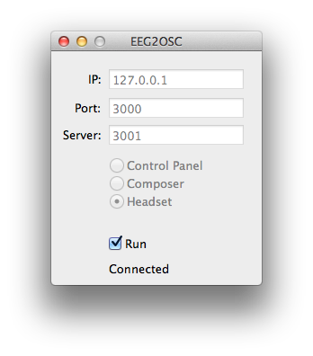

# EEG2OSC

EEG2OSC is simple application written in Objective-C for two-way communication with [Emotiv EPOC](http://emotiv.com/epoc/) using familiar OSC protocol.

EEG2OSC was prepared for [Sensorium](http://sensorium.com.pl) - audio installation by [Rafał Zapała](http://www.zapala.com.pl), more info: [http://treesmovethemost.com/2014-10-10-sensorium](http://treesmovethemost.com/2014-10-10-sensorium).

# Outgoing OSC messages

`/EEG/ED_AF3`, `/EEG/ED_F7`, `/EEG/ED_F3`, `/EEG/ED_FC5`, `/EEG/ED_T7`, `/EEG/ED_P7`, `/EEG/ED_O1`, `/EEG/ED_O2`, `/EEG/ED_P8`, `/EEG/ED_T8`, `/EEG/ED_FC6`, `/EEG/ED_F4`, `/EEG/ED_F8`, `/EEG/ED_AF4` - raw data from EEG (requires research edition of Emotiv SDK)

`/quality/ED_AF3`, `/quality/ED_F7`, `/quality/ED_F3`, `/quality/ED_FC5`, `/quality/ED_T7`, `/quality/ED_P7`, `/quality/ED_O1`, `/quality/ED_O2`, `/quality/ED_P8`, `/quality/ED_T8`, `/quality/ED_FC6`, `/quality/ED_F4`, `/quality/ED_F8`, `/quality/ED_AF4` - electrode connection quality

`/affectiv/engagement`, `/affectiv/excitement-long`, `/affectiv/excitement-short`, `/affectiv/frustration`, `/affectiv/meditation` - affective data (`0.0` - `1.0` values)

`/expressiv/blink`, `/expressiv/wink-left`, `/expressiv/wink-right`, `/expressiv/look-left`, `/expressiv/look-right` - expressiv data (trigger)

`/gyro` - x/y gyroscope (two integer values)

`/cognitiv/action` - recognized action with power, currently supported actions: "neutral", "push", "lift" (action and `0.0` - `1.0` value)

`/cognitiv/event` - training events: "started", "succeeded", "failed", "completed", "rejected"

# Incoming OSC messages

`/train/neutral` - train neutral state

`/train/lift` - train "lift" action

`/train/push` - train "push" action

`/train/accept` - accept training

`/train/reject` - reject training

# Working with training actions

Training is the trickiest part, example workflow for training "neutral" action:

1. Send `/train/neutral` to EEG2OSC
2. Wait for `/cognitiv/event` "started"
3. Wait for `/cognitiv/event` "succeeded"
4. Send `/train/accept`
5. Wait for `/cognitiv/event` "completed"
6. Wait for `/cognitiv/action` "neutral **value**", where **value** is between `0.0` and `1.0`

Training for push and lift looks the same, but remember to always train "neutral" first.

